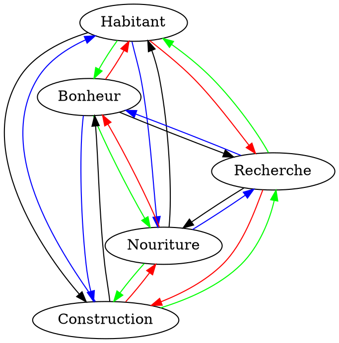

# Game Design

## Interection entre les types de bâtiments

Couleur | Modificateur (indicatif)
:------:|:------------------------:
Rouge|+ +
Vert|+
Bleu|-
Noir|- -

Chaque bâtiment produit sa ressource mais cette production est modifié par different facteurs dont la proximite des autres bâtiments comme cite precedement.