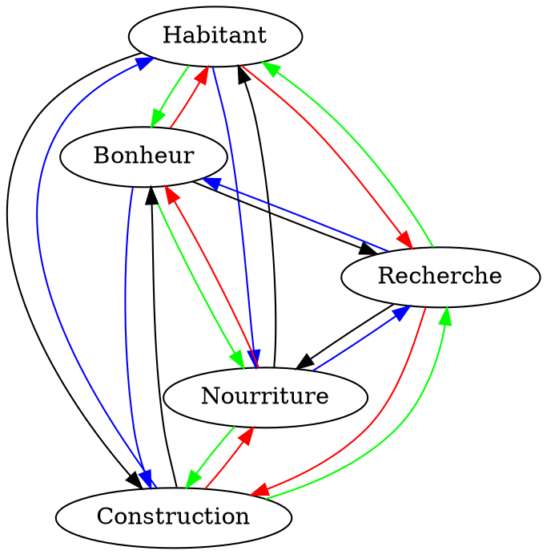

# Game Design

## Intéractions entre les types de bâtiments

Couleur | Modificateur (indicatif)
:------:|:------------------------:
Rouge|+ +
Vert|+
Bleu|-
Noir|- -

Chaque bâtiment produit sa ressource, mais cette production est modifiée par differents facteurs dont la proximité des autres bâtiments.