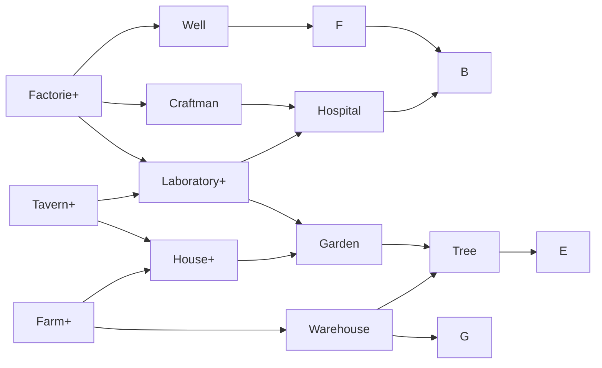
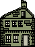
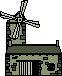

# Game Design

## The different ressources

| Ressource |                                                                            Explanation                                                                             |
| :-------: | :----------------------------------------------------------------------------------------------------------------------------------------------------------------: |
|  Citizen  |       Citizens are the main ressource of the game. They are placed in the buildings to activate the production or to improve it. They also have a life time.       |
| Happiness |                                                      Happiness is the ressource which allows citizens' birth.                                                      |
|   Food    |                   Food is the ressource consumed by every citizen. It is necessary to find a balance. If the food is at zero, citizens will die.                   |
| Research  |                             Research is the ressource which lets you obtain improvements, bonuses, new buildings or enlarge your city.                             |
|   Stone   |                                             Stone is the ressource which lets you build new buildings or improve them.                                             |
| Building  | Buildings allow ressources production. They are disintegrating over time, so they must be repaired with stone, otherwise they will collapse and citizens will die. |

## The different types of buildings

|   Type    |                                                                                          Explanation                                                                                           |
| :-------: | :--------------------------------------------------------------------------------------------------------------------------------------------------------------------------------------------: |
| Citizens  |                                                      These buildings increase the the city's citizens capacity and allow citizens' birth.                                                      |
| Happiness |                                                                        These buildings produce the Happiness ressource.                                                                        |
|   Food    |                                                             These buildings increase the capacity of Food storage and produce it.                                                              |
| Research  |                                                         These buildings produce the Research ressource and let you improve your city.                                                          |
|   Stone   |                                                             These buildings increase the capacity of Stone storage and produce it.                                                             |
|   Water   | These buildings are necessary for the efficiency of citizens. They generate an area in which a set number of citizens can access water. A citizen without water supply will be less effective. |

## Interactions between the different types of buildings

Each building produces its ressource, but this production is influenced by different factors, including the proximity other buildings.

![
  Citizens  -> Happiness[color=green]
  Research  -> Happiness[color=blue]
    Stone   -> Happiness[color=yellow]
    Food    -> Happiness[color=red]
  Citizens  ->   Stone  [color=yellow]
  Happiness ->   Stone  [color=blue]
  Research  ->   Stone  [color=red]
    Food    ->   Stone  [color=green]
  Citizens  ->   Food   [color=blue]
  Happiness ->   Food   [color=green]
    Stone   ->   Food   [color=red]
  Research  ->   Food   [color=yellsow]
  Happiness -> Citizens [color=red]
    Stone   -> Citizens [color=blue]
    Food    -> Citizens [color=yellow]
  Research  -> Citizens [color=green]
  Citizens  -> Research [color=red]
  Happiness -> Research [color=yellow]
    Stone   -> Research [color=green]
    Food    -> Research [color=blue]
](assets/penta.png)

| Color  | Modifier (indicative) |
| :----: | :-------------------: |
|  Red   |          + +          |
| Green  |           +           |
|  Blue  |           -           |
| Yellow |          - -          |

##Research tree

## Buildings
|Name|Picture|Resource|Slot|Production|Effet|
|:-:|:-:|:-:|:-:|:-:|:-:|
|House||Citizens|6 citizens|1 Citizen / 100 Happiness|Increases the maximum number of citizens by 6|
|Farm||Food|2 citizens|4 Foods / Citizen / Month|Increases the maximum number of citizens by 100
|Tavern||Happiness|2 citizens|1 Happiness / Citizen / Month|None|

