# Game Design

## The different ressources

| Ressource |                                                                            Explanation                                                                             |
| :-------: | :----------------------------------------------------------------------------------------------------------------------------------------------------------------: |
|  Citizen  |       Citizens are the main ressource of the game. They are placed in the buildings to activate the production or to improve it. They also have a life time.       |
| Happiness |                                                      Happiness is the ressource which allows citizens' birth.                                                      |
|   Food    |                   Food is the ressource consumed by every citizen. It is necessary to find a balance. If the food is at zero, citizens will die.                   |
| Research  |                             Research is the ressource which lets you obtain improvements, bonuses, new buildings or enlarge your city.                             |
|   Stone   |                                             Stone is the ressource which lets you build new buildings or improve them.                                             |
| Building  | Buildings allow ressources production. They are disintegrating over time, so they must be repaired with stone, otherwise they will collapse and citizens will die. |
## Buildings
|Name|Picture|Type|Slot|Production|Effet|
|:-:|:-:|:-:|:-:|:-:|:-:|
|House|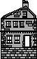|Citizen|6 citizens|1 Citizen / 100 Happiness|Increases the maximum number of citizens by 6|
|House+|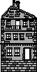|Citizen|9 citizens|1 Citizen / 100 Happiness|Increases the maximum number of citizens by 9|
|School|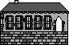|Citizen|4 citizens|None|Now citizen cost 75 Hapiness to birth. Increases the maximum number of citizens by 4|
|Farm|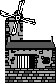|Food|2 citizens|4 Foods / Citizen in / Month|Increases the maximum number of foods by 100|
|Farm+||Food|3 citizens|4 Foods / Citizen in / Month|Increases the maximum number of foods by 150|
|Warehouse|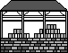|Food|1 citizen|6 Foods / Citizen in / Month|Increases the maximum number of foods and stone by 200|
|Tavern||Happiness|2 citizens|1 Happiness / Citizen in / Month|None|
|Tavern+||Happiness|3 citizens|1 Happiness / Citizen in / Month|None|
|Garden|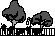|Happiness|1 citizen|1 Happiness / Citizen in / Month|Sell 50 food for 50 happiness|
|Laboratory|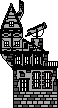|Research|2 citizens|3 Research / Citizen in / Month|None|
|Laboratory+||Research|3 citizens|3 Research / Citizen in / Month|None|
|Hospital|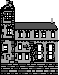|Reaserch|1 citizen|4 Research / Citizen in / Month|Nez Citizens die 1.5 times slower. (not combinable)|
|Factory|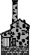|Stone|2 citizens|1 Stone / Citizen in / Month|Increases the maximum number of stones by 100|
|Factory+||Stone|3 citizens|1 Stone / Citizen in / Month|Increases the maximum number of stones by 150|
|Craftman|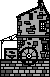|Stone|1 citizen|2 Stone / Citizen in / Month|The buildings are damaged twice less. (not combinable)|
|Well|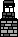|Other|None|None|Increases by 50% the effectiveness of 2 citizens who are in the 80 pixels around the well|
|Tree||Other|None|None| Stands on a building and prevents it from negative interaction|
## Interactions between the different types of buildings

Each building produces its ressource, but this production is influenced by different factors, including the proximity other buildings.

![
  Citizens  -> Happiness[color=green]
  Research  -> Happiness[color=blue]
    Stone   -> Happiness[color=yellow]
    Food    -> Happiness[color=red]
  Citizens  ->   Stone  [color=yellow]
  Happiness ->   Stone  [color=blue]
  Research  ->   Stone  [color=red]
    Food    ->   Stone  [color=green]
  Citizens  ->   Food   [color=blue]
  Happiness ->   Food   [color=green]
    Stone   ->   Food   [color=red]
  Research  ->   Food   [color=yellsow]
  Happiness -> Citizens [color=red]
    Stone   -> Citizens [color=blue]
    Food    -> Citizens [color=yellow]
  Research  -> Citizens [color=green]
  Citizens  -> Research [color=red]
  Happiness -> Research [color=yellow]
    Stone   -> Research [color=green]
    Food    -> Research [color=blue]
](assets/penta.png)

| Color  | Interaction modificator |
| :----: | :-------------------: |
|  Red   |          +0.4          |
| Green  |           +0.2           |
|  Blue  |           -0.2           |
| Yellow |          -0.4          |

## Research tree
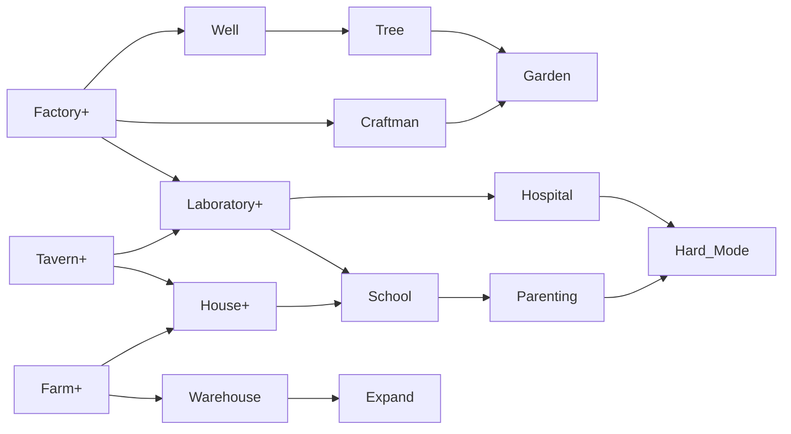